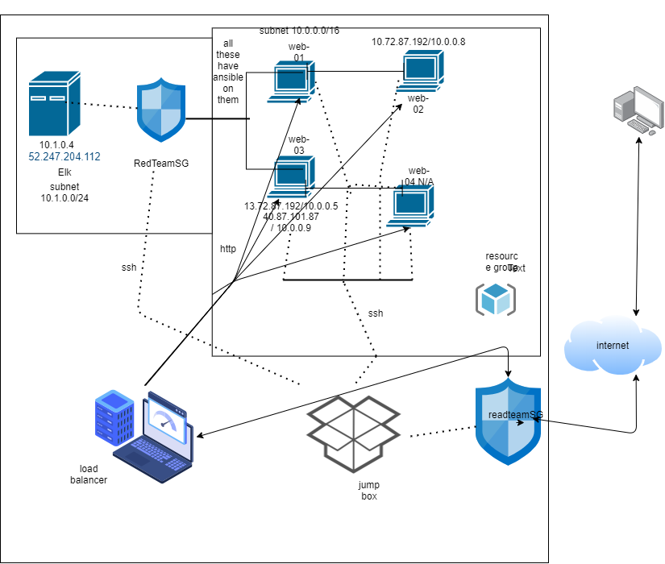

# ELKstack_Repo_Hw
# 07-07-2020 elkstack project
# Keola Blas

The purpose of this network is to expose a load-balenced and monitored instence of DVWA;
The Damn Vulnerable Web Application.

The load balencer ensures that the appication will be well kept while resticting access 
to the network.
	- Load-balencers help sort and midigate too much traffic in the network.
	Using a jump box allows any ssh traffic to run through my security group 
	and access to my containers

after creating my cloud network we started work on the ELK server to allow users like 
myself to monitor the vulerable VM's for chanes to the Logs and the system operations.
by intergrating two diffrent "Beats".
	-Filebeat which logs all file all changes to any Files on the machine its 
	intalled on.
	-Metricbeat which logs all "hardware changes" like memory usage and Cpu usage.

#Configuration Details
| Name     | Function | IP Address | Operating System |
|----------|----------|------------|------------------|
| Jump Box | Gateway  | 10.0.0.1   | Linux            |
| Web1     |          | 10.0.0.5   | Linux            |
| web2     |          | 10.0.0.8   | Linux            |
| web3     |          | 10.0.0.9   | Linux            |
# in my diagram i have a "web-04" but that cost money so I couldnt add it too my network

### Access policies
All of the Web-0* Vms are not exposed to the internet the only machine accessable 
by the internet is my JumpBox-Provisioner.

The ip address that is on the whitelist is my local IP on both the JumpBox-Provisioner
and the Elk net alowing me access as RedTeam_admin.

###ELK Configuration 
We used ansible to automate configuration of the Elk machine. 
No configuration was preformed manually.

One of the advantages to automating the configuration is if we need to update 
or change something we dont have to do a bunch of manual changes allowing us 
to just modify the Configuration file.

#Steps to Elk Installation
-Make an ELK VM #we used portal.azure
	-Requires 4gb of ram if you want it with a "Beat"
	-no Avalibility Zones
	-Add elk to the ansible contaier with a new Playbook
	-add ip too /etc/ansible/hosts under a separate host then the other ones in there

# this is all asuming you have an ansible container and hosts file setup
	-then make the Ansible playbook in /etc/ansible/ called install-Elk.yml
	my playbook looks more or less like this
---
        >> - name: Config elk 
        >>   hosts: Elk
        >>   become: true
        >>   tasks:
        >>    - name: docker.io
        >>      apt: 
        >>        update_cache: yes 
        >>        name: docker.io
        >>        state: present
        >>    - name: Install pip
        >>      apt:
        >>         name: python3-pip
        >>         state: present 
        >>    - name: Use more memory
        >>      sysctl:
        >>        name: vm.max_map_count
        >>        value: '262144'
        >>        state: present
        >>        reload: yes
        >>    - name: Install Docker python module
        >>      pip:
        >>        name: docker
        >>        state: present 
        >>    - name: download and launch elk container 
        >>      docker_container:
        >>        name: elk 
        >>        image: sebp/elk
        >>        state: started
        >>        restart_policy: always
        >>        published_ports: 
        >>         - 5601:5601
        >>          - 9200:9200
        >>          - 5044:5044
        >>    - name: Enable docker service
        >>      systemd:
        >>          name: docker 
        >>          enabled: yes
# the '>>' is just to show that i did it in nano on my notes, so DON'T keep them
	-Then run ansible-playbook /etc/ansible/install-Elk.yml

# The 'image: sebp/elk'you may need to find the image that works for you and the beats your trying to use we used filebeat-7.4.0-amd64.deb so the image had to be changed 
# when we installed it
	- in the mean time while that is running, make a new inbound security rule on azure for the ELK network.
	- on port 5601
	- protocol = any
	- source = <my ip>
	- destination = virtual network

	-then try to access it with http://<ELK's network VM's ip>:5601/app/kibana

### Target Machiens & Beats
This Elk server is configured to monitor all of the machines under the Webservers list 
in the /etc/ansible/hosts file
web-01,02 & 03

we've succsessfully installed metric and Filebeat onto our Elkstack server to monitor 
the machines under the webservers in the /etc/ansible/hosts file.
	
	- metricbeat monitors things like memory and CPU usage on the machines along 
	  with other Metrics. allowing us to keep an eye on viruses, and crypto mining. 
	  it hels us monitor how things are being used on the VM's
	
	- Filebeat monitors our log files and looks for changes and keeps track of when 
	  things were accessed and used. if someone were to move the file we would know

# Using the playbook

	- first to run the playbook you need to get into the Docker container with 
	  the ansible installed on there.
	- copy the yml file to /etc/ansible/someplaybook.yml
	- update the yml file to include the correct image and published_port
	- then run the playbook with -> ansible-playbook /etc/ansible/someplaybook.yml

	- then navigate to http://<the IP of the VM installed with the playbook>:5601/app/kibana

#this is for the Elk stack server
DVWA is http://<VM's Ip>/setup
#DVWA has its own playbook
	- the playbook file is the /etc/ansible/ file and you copy it from /etc/
	  if you want to change a specific playbook and a specific machine you need to 
	  specify which of the playbooks IN the /etc/ansible/ file you want to modify

#Example: -> nano /etc/ansible/install-Elk.yml *this will nano me into 
#the 'install-Elk.yml' file under the ansible directory.

	- in order to specify the server you put filebeat on make sure in the yml file, 
	  the host is set to the server you want, you can check the servers you have in 
	  the /etc/ansible/hosts file.
#make sure you modify the 'hosts' file to include the machines and seporate the elk 
#server 10.1.0.4 is under a diffrent set to the noraml webservers with web-0102 & 03

	- Remember the URL to the Elk server is http://<Elk's Ip>:5601/app/kibana
#Commands:
#run the playbook = ansible-playbook /etc/ansible/install-Elk.yml
  

 

